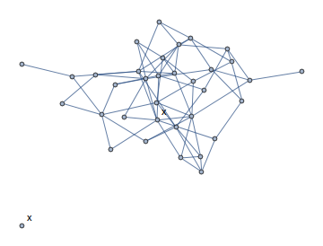
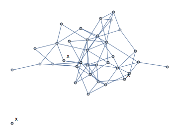
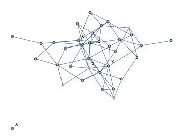

ppr-leharada-nesrotom
==================

- kompilace: gcc -Wall -pedantic -ggdb -o main main.c -lm
- valgrind: valgrind --leak-check=full --show-reachable=yes ./main tests/0-graph.txt

zadani:
https://edux.fit.cvut.cz/courses/MI-PPR.2/labs/zadani_semestralnich_praci#uloha_domi-dominujici_mnozina_grafu

paralelni algoritmus je L-PBB-DFS-D:
https://edux.fit.cvut.cz/courses/MI-PPR.2/labs/prohledavani_do_hloubky#paralelni_bb-dfs_s_prohledavanim_dde_stavoveho_prostoru_pbb-dfs-d

3-dom
=====

	n@t:~/Dropbox/github/ppr-leharada-nesrotom$ time ./main tests/5-graph.txt 3
	00000000000000001100000000000000000

	real	0m0.065s
	user	0m0.061s
	sys	0m0.008s

	n@t:~/Dropbox/github/ppr-leharada-nesrotom$ time ./main tests/5-graph-3-optimized.txt 3
	01000000000000000000000000000000001

	real	0m0.023s
	user	0m0.023s
	sys	0m0.000s

2-dom
=====

	n@t:~/Dropbox/github/ppr-leharada-nesrotom$ time ./main tests/5-graph.txt 2
	00110001000000001000000000000000000

	real	0m3.204s
	user	0m3.206s
	sys	0m0.000s

	n@t:~/Dropbox/github/ppr-leharada-nesrotom$ time ./main tests/5-graph-2-optimized.txt 2
	11100000000000000000000000000000001

	real	0m0.872s
	user	0m0.873s
	sys	0m0.000s

1-dom
=====
	it took too much time
